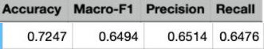

#### Competition 
---
 Sarcasm detection is the process of identifying whether a piece of text is sarcastic or not. Sarcasm is one of the main challenges for sentiment analysis systems. The reason for this is that a sarcastic sentence usually carries a negative implicit sentiment, while it is expressed using positive expressions. This contradiction between the surface sentiment and the intended one creates a complex challenge for sentiment analysis systems.Sarcasm detection received attention in other languages, but Arabic still lags behind.[Competition Link](https://competitions.codalab.org/competitions/28003#learn_the_details)

 #### DataSet
 ---
 ArSarcasm is a new Arabic sarcasm detection dataset. The dataset was created using previously available Arabic sentiment analysis datasets (SemEval 2017 and ASTD) and adds sarcasm and dialect labels to them. The dataset contains 10,547 tweets, 1,682 (16%) of which are sarcastic. For more details, please check our paper From Arabic Sentiment Analysis to Sarcasm Detection.[The ArSarcasm Dataset](https://github.com/iabufarha/ArSarcasm)

 #### Preprocessing 
  ---

   * Data Cleaning 
   data cleaning phase contain remove arabic stop words ,remove non arabic characters , remove emoji .
   * Handle Imbalance problem
   in this data true class number less than false class number.handle this imbalance problem  through some  steps : 
      1. Back translation, translate arabic to english then translate this english output to arabic again to get new version of text .
      2. Replace with Synonym word 
      replace words in text with its Synonyms using wordnet 
      3. Replace with similar words
      replace words with its first and second similars words from pretrained word2vec [aravec model](https://bakrianoo.ewr1.vultrobjects.com/aravec/full_uni_cbow_300_twitter.zip) 


#### Traing 
---
Using pretrained [Arabert model](https://huggingface.co/aubmindlab/bert-base-arabertv01) followd by classification head trained on dataset. 

#### Results 
---
Results on test data.



#### Setup 
---
Download pretrained [model](https://drive.google.com/drive/folders/1ep1AxTQG1j2gdP4oTew28MocnlruY4VD?usp=sharing) in model_final folder.


```
pip install -r requirements.txt 
python app.py
```

#### With 

[Farid](https://www.kaggle.com/ahmedfry)
[Reda](https://www.kaggle.com/redaalsweedy)


   
  


